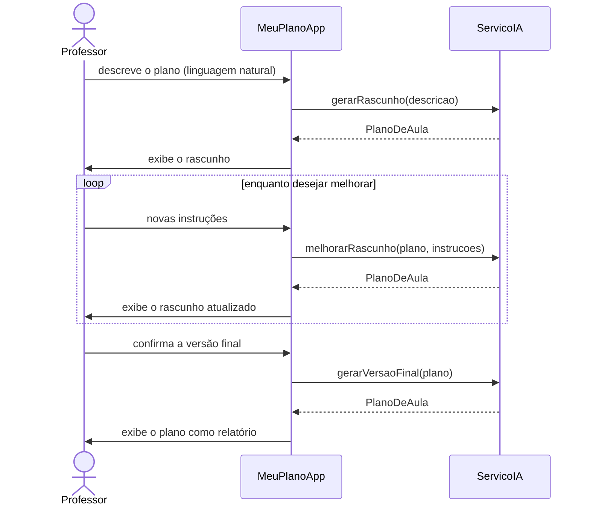
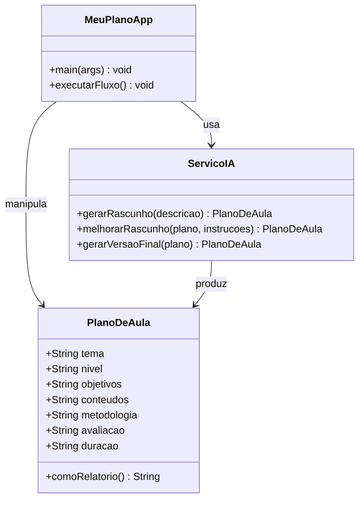
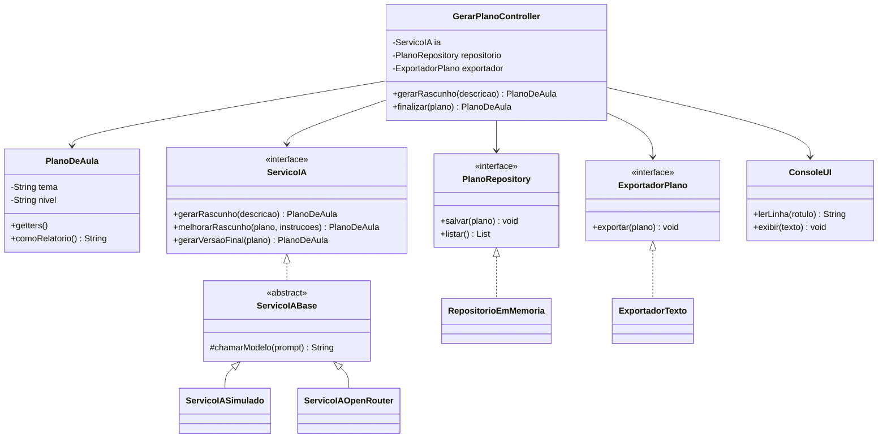

<!--
SLIDE 1 — CAPA
O layout "cover" monta tudo a partir do .env (composable useDisciplina).
-->

---

## layout: default

# O que é o MeuPlano.AI?

Um aplicativo que ajuda o **professor a montar planos de aula** com o apoio de IA.

- Você descreve o que quer **em linguagem natural**
- A IA devolve um **rascunho estruturado** (objetivos, conteúdos, metodologia…)
- Você **revisa, pede ajustes** e gera a **versão final**

> Nesta aula ele é o pretexto para uma lição maior: **como um código evolui da
> análise para o design orientado a objetos.**

---

layout: image-right
image: ./dor_professor.png

---

# A dor

> "Toda semana eu **perco horas** montando planos de aula.

> Começo do zero, copio de planos antigos, nunca lembro o formato que a
> coordenação pediu…

> Queria só **descrever a aula** e receber um rascunho pronto pra ajustar."

<br>

— Prof. Raimundo Nonato

---

## layout: module

# UC01 — Gerar Plano de Aula

O caso de uso que vamos implementar

---

## layout: default

# UC01 — Ator e condições

**Ator principal:** Professor

**Pré-condições**

- O sistema deve estar disponível.
- A integração com o serviço de IA deve estar configurada.

**Pós-condições**

- O professor obtém um plano de aula.
- O professor **salva** o plano em sua conta.
- O professor **exporta** o plano em PDF.

---

## layout: default

# UC01 — Fluxo principal

1. O professor acessa a tela inicial pública do sistema.
2. Informa, **em linguagem natural**, o plano que deseja gerar.
3. Submete a requisição para gerar o plano.
4. O sistema exibe um **formulário com os campos preenchidos** automaticamente.
5. O professor **revisa** os campos.
6. Submete a requisição para gerar a **versão final**.
7. O sistema exibe o plano em **formato de relatório** — e o caso de uso termina.

---

## layout: default

# UC01 — Fluxos alternativos

- **3.1** — Não autenticado → o app pede autenticação, executa o passo 3 e
  retorna ao passo 4.
- **5.1** — O professor **edita os campos manualmente** e segue para o passo 6.
- **5.2** — O professor **envia outras instruções** para a IA e retorna ao passo 5.
- **7.1** — O professor **salva** o plano e o caso de uso termina.
- **7.2** — O professor **exporta** o plano como PDF e o caso de uso termina.

<br>

> O laço **5.2** (melhorar com novas instruções) é o coração da interação.

---

## layout: default

# Diagrama de sequência — fluxo principal



---

## layout: default

# Do texto às classes

Quais **substantivos** do domínio viram classe?

| Substantivo                 | Vira…                                            |
| --------------------------- | ------------------------------------------------ |
| **Plano de aula**           | ✅ classe `PlanoDeAula` (entidade)               |
| **Serviço de IA**           | ✅ classe `ServicoIA` (gera/melhora/finaliza)    |
| Professor                   | 👤 ator (fora do recorte de código por enquanto) |
| Tema, nível, objetivos…     | 🔤 **atributos** de `PlanoDeAula`                |
| Formulário, tela, relatório | 🖥️ interface com o usuário (UI)                  |

> Na **análise** ficamos com **duas classes** e a aplicação. Simples de propósito.

---

## layout: default

# Diagrama de classes — Análise



Sem interface, sem herança, sem polimorfismo. **Só o domínio funcionando.**

---

## layout: module

# Fase 1 — Análise

Do domínio ao código

---

## layout: default

# Passo 1 — A entidade `PlanoDeAula`

O domínio + um método que sabe se imprimir:

```java
public class PlanoDeAula {
    public String tema;
    public String nivel;
    public String objetivos;
    // ... conteudos, metodologia, avaliacao, duracao

    public String comoRelatorio() {
        return "Tema: " + tema + "\n"
             + "Objetivos: " + objetivos + "\n"
             + "Metodologia: " + metodologia + "\n";
        // (formatação completa no arquivo)
    }
}
```

> Campos **públicos** de propósito: clareza sobre design nesta fase.

---

## layout: default

# Passo 2 — A IA simulada `ServicoIA`

Uma **classe simples** (não interface). A IA é **simulada** por template:

```java
public class ServicoIA {
    public PlanoDeAula gerarRascunho(String descricao) {
        PlanoDeAula plano = new PlanoDeAula();
        plano.tema = descricao;
        plano.objetivos = "Compreender os conceitos de \"" + descricao + "\".";
        plano.metodologia = "Aula expositiva dialogada com exercícios.";
        return plano;
    }
    // melhorarRascunho(plano, instrucoes) e gerarVersaoFinal(plano)
}
```

> Sem rede, sem Ollama: o foco é o **fluxo do domínio**, não o modelo real.

---

## layout: default

# Passo 3 — O fluxo no terminal `MeuPlanoApp`

Tudo junto: I/O, orquestração e uso da IA — **misturados** de propósito:

```java
public void executarFluxo() {
    Scanner entrada = new Scanner(System.in);
    ServicoIA ia = new ServicoIA();

    String descricao = entrada.nextLine();
    PlanoDeAula plano = ia.gerarRascunho(descricao);
    System.out.println(plano.comoRelatorio());

    // laço de melhoria (fluxo 5.2) ...
    plano = ia.gerarVersaoFinal(plano);
    System.out.println(plano.comoRelatorio());
}
```

---

## layout: default

# Rodando no terminal

```text {*}{maxHeight:'380px'}
==================================================
  MeuPlano.AI — Gerador de Planos de Aula
==================================================
Descreva o plano de aula que deseja gerar:
> Algoritmos de ordenação

--- Rascunho gerado (revise os campos) ---
Tema.........: Algoritmos de ordenação
Objetivos....: Compreender os conceitos centrais de "Algoritmos de ordenação".
Metodologia..: Aula expositiva dialogada com exercícios práticos.

Deseja enviar instruções para melhorar? (s/n)
> n

>>> VERSÃO FINAL DO PLANO DE AULA <<<
...
```

✅ Funciona — **sem** interface, herança ou polimorfismo.

---

## layout: module

# Fase 2 — Design

Refatorando para OO

---

## layout: default

# Por que refatorar?

O código de análise funciona, mas…

- 🧱 **Tudo acoplado** — `MeuPlanoApp` faz I/O, orquestra o fluxo **e** chama a IA.
- 🔒 **IA fixa** — só existe uma `ServicoIA`; conectar outra IA significa
  **reescrever** a classe.
- 🔀 **I/O misturada** — `System.out`/`Scanner` espalhados pela regra de negócio.
- 📦 **Entidade exposta** — campos públicos, qualquer um altera qualquer coisa.

> O comportamento vai continuar **idêntico**. Muda a **estrutura** — e é aí que
> mora a lição de OO.

---

## layout: default

# Diagrama de classes — Design



---

## layout: default

# Passo 1 — Encapsular a entidade

**Antes (análise)** — campos públicos:

```java
public class PlanoDeAula {
    public String tema;
    public String objetivos;
}
```

**Depois (design)** — campos privados + getters/setters + Javadoc:

```java
/** Entidade de domínio que representa um plano de aula. */
public class PlanoDeAula {
    private String tema;
    public String getTema() { return tema; }
    public void setTema(String tema) { this.tema = tema; }
}
```

> **Javadoc** é o comentário entre `/** ... */` que documenta classes e métodos e
> de onde a ferramenta `javadoc` gera a documentação do código em HTML.

---

## layout: default

# Passo 2 — Interface + classe abstrata

A IA vira um **contrato** (`interface`) com lógica comum numa **classe abstrata**:

```java
public interface ServicoIA {
    PlanoDeAula gerarRascunho(String descricao);
    PlanoDeAula melhorarRascunho(PlanoDeAula plano, String instrucoes);
    PlanoDeAula gerarVersaoFinal(PlanoDeAula plano);
}

public abstract class ServicoIABase implements ServicoIA {
    // monta o prompt, formata o resultado... (lógica comum)
    protected abstract String chamarModelo(String prompt); // Template Method
}
```

> O passo que **varia** entre provedores é só `chamarModelo`.

---

## layout: default

# Passo 2 — Polimorfismo: várias IAs

Cada provedor é uma **subclasse** que só implementa `chamarModelo`:

```java
public class ServicoIASimulado extends ServicoIABase {
    protected String chamarModelo(String prompt) {
        return "[gerado pela IA Simulada]";
    }
}
public class ServicoIAOpenRouter extends ServicoIABase {
    protected String chamarModelo(String prompt) {
        return "[gerado pela IA OpenRouter (simulado)]"; // futuro: HTTP real
    }
}
```

No `main`, **trocar de IA = trocar uma linha**:

```java
ServicoIA ia = new ServicoIASimulado();   // ou new ServicoIAOpenRouter();
```

---

## layout: default

# Passo 3 — Separar responsabilidades

Cada classe passa a ter **um motivo para mudar**:

```java
public class GerarPlanoController {     // ORQUESTRA o UC01
    private final ServicoIA ia;          // depende de ABSTRAÇÕES
    private final PlanoRepository repositorio;
    private final ExportadorPlano exportador;
    private final ConsoleUI ui;          // ENTRADA/SAÍDA isolada
    // recebe tudo pelo construtor (injeção de dependência)
}
```

- `ConsoleUI` → fala com o terminal
- `PlanoRepository` / `ExportadorPlano` → **interfaces** (salvar e exportar)
- o controller **não sabe** qual IA, repositório ou exportador é usado

---

## layout: default

# Síntese da evolução

| O que **era** (análise)           | O que **virou** (design)                              |
| --------------------------------- | ----------------------------------------------------- |
| Procedural, tudo no `main`        | Responsabilidades **separadas**                       |
| `PlanoDeAula` com campos públicos | Entidade **encapsulada**                              |
| `ServicoIA` única e fixa          | **Interface** + **classe abstrata** (Template Method) |
| Uma IA possível                   | Várias IAs por **polimorfismo**                       |
| I/O espalhada na regra            | `ConsoleUI` isola a interface                         |
| Sem persistir/exportar            | `PlanoRepository` e `ExportadorPlano` (interfaces)    |

> Mesmo **comportamento**, estrutura muito melhor: **baixo acoplamento** e
> **aberto à extensão**. Essa é a passagem **análise → design**.

---

## layout: end

# Obrigado!

Engenharia de Software I · MeuPlano.AI
