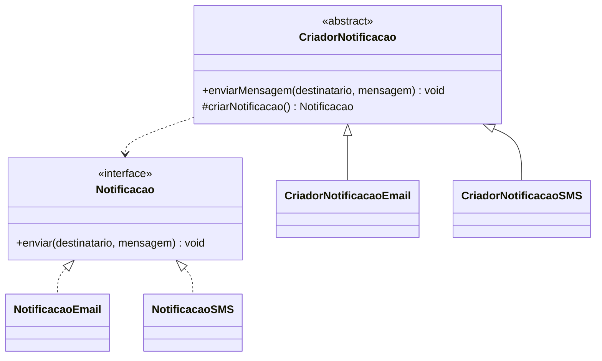
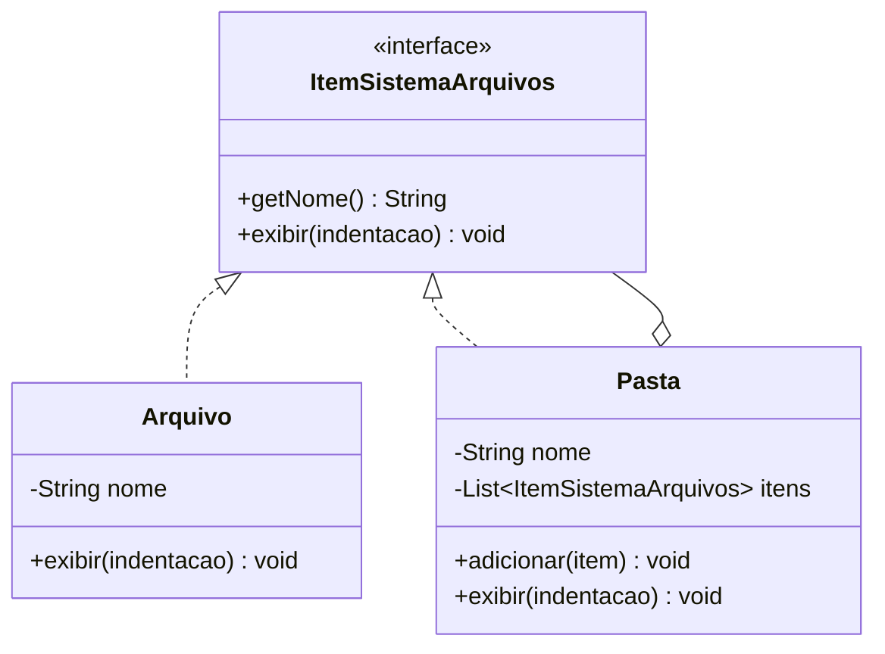
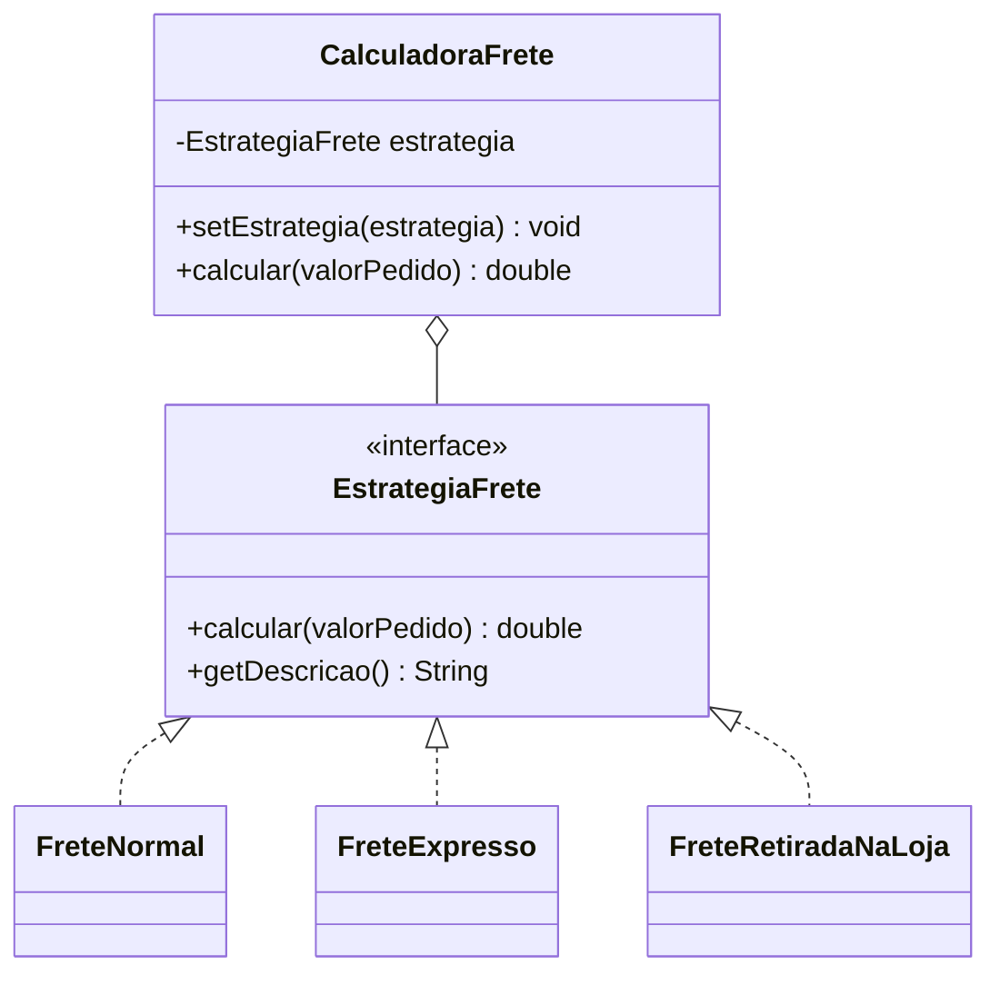

# Padrões de Projeto GoF

## Factory Method · Composite · Strategy

INF03082 — Engenharia de Software I

IF Sudeste MG — Campus Manhuaçu

---

# Origem dos padrões de projeto

- A ideia vem da arquitetura: Christopher Alexander descreveu soluções
  recorrentes para problemas recorrentes de projeto.
- Na computação, a proposta ganhou força com o livro de 1994 conhecido como
  **GoF**: *Design Patterns: Elements of Reusable Object-Oriented Software*.
- O foco não é copiar código pronto.
- O foco é dar nome, estrutura e intenção para decisões de projeto.

---

# O que é um padrão de projeto?

Um padrão de projeto descreve uma solução recorrente para um problema recorrente
em um contexto específico.

Ele normalmente apresenta:

- o problema que aparece com frequência;
- a intenção da solução;
- os participantes envolvidos;
- as consequências positivas e os cuidados.

> Padrão de projeto não é algoritmo, biblioteca nem framework.

---

# Visão geral dos padrões GoF

| Categoria | Pergunta central | Exemplos |
| --- | --- | --- |
| Criacionais | Como criar objetos com menor acoplamento? | Factory Method, Abstract Factory, Builder |
| Estruturais | Como compor classes e objetos? | Composite, Adapter, Facade |
| Comportamentais | Como distribuir responsabilidades e algoritmos? | Strategy, Observer, Command |

Os padrões ajudam a discutir design orientado a objetos com vocabulário comum.

---

# Padrões estudados neste módulo

Nesta sequência de três aulas, vamos estudar:

- **Factory Method**: criação de notificações.
- **Composite**: estrutura de arquivos e pastas.
- **Strategy**: cálculo de frete.

Cada padrão será visto com problema, estrutura, código Java e atividade prática.

---

# Organização das aulas

| Aula | Duração | Foco |
| --- | --- | --- |
| 1 | 45 min | Introdução aos GoF + Factory Method |
| 2 | 45 min | Composite |
| 3 | 45 min | Strategy + comparação final |

Em todas as aulas, a pergunta principal é:

> Que parte do código tende a mudar e como isolar essa variação?

---
layout: module
---

# Aula 1

## Factory Method

Padrão criacional para delegar a criação de objetos.

---

# Problema concreto

Um sistema precisa enviar notificações por diferentes canais:

- e-mail;
- SMS;
- futuramente, push, WhatsApp ou outro canal.

A primeira solução costuma ser instanciar a classe concreta diretamente no
código cliente.

---

# Solução limitada

```java
if (canal.equals("email")) {
    notificacao = new NotificacaoEmail();
} else if (canal.equals("sms")) {
    notificacao = new NotificacaoSMS();
}
```

Problemas:

- o cliente conhece todas as classes concretas;
- cada novo canal tende a alterar o mesmo trecho;
- criação e uso ficam misturados.

---

# Intenção do Factory Method

Definir uma operação de criação em uma classe criadora e deixar subclasses
decidirem qual objeto concreto será instanciado.

No exemplo:

- o cliente usa `CriadorNotificacao`;
- cada criador concreto fabrica um tipo de `Notificacao`;
- o fluxo de envio permanece no criador abstrato.

---

# Estrutura do exemplo



---

# Produto: interface principal

Arquivo: `Notificacao.java`

```java
public interface Notificacao {

    void enviar(String destinatario, String mensagem);
}
```

O cliente pode trabalhar com `Notificacao` sem depender de e-mail ou SMS.

---

# Produto concreto

Arquivo: `NotificacaoEmail.java`

```java
public class NotificacaoEmail implements Notificacao {

    @Override
    public void enviar(String destinatario, String mensagem) {
        System.out.println("[E-MAIL] Para: " + destinatario);
        System.out.println("Mensagem: " + mensagem);
    }
}
```

Cada produto concreto sabe executar sua própria forma de envio.

---

# Criador: fluxo comum + método fábrica

Arquivo: `CriadorNotificacao.java`

```java
public abstract class CriadorNotificacao {

    protected abstract Notificacao criarNotificacao();

    public void enviarMensagem(String destinatario, String mensagem) {
        Notificacao notificacao = criarNotificacao();
        notificacao.enviar(destinatario, mensagem);
    }
}
```

O método `enviarMensagem` usa o produto, mas não sabe qual classe concreta foi
criada.

---

# Criador concreto

Arquivo: `CriadorNotificacaoSMS.java`

```java
public class CriadorNotificacaoSMS extends CriadorNotificacao {

    @Override
    protected Notificacao criarNotificacao() {
        return new NotificacaoSMS();
    }
}
```

A variação fica concentrada no método fábrica.

---

# Cliente

Arquivo: `Main.java`

```java
CriadorNotificacao criadorEmail = new CriadorNotificacaoEmail();
CriadorNotificacao criadorSMS = new CriadorNotificacaoSMS();

criadorEmail.enviarMensagem(
        "professora@if.edu.br",
        "Seu plano de aula foi gerado.");

criadorSMS.enviarMensagem(
        "(33) 99999-0000",
        "Lembrete: aula de Engenharia de Software às 19h.");
```

O cliente escolhe o criador, mas não constrói o produto diretamente.

---

# Fluxo de execução

1. `Main` cria um `CriadorNotificacao`.
2. `Main` chama `enviarMensagem`.
3. `CriadorNotificacao` chama `criarNotificacao`.
4. A subclasse retorna `NotificacaoEmail` ou `NotificacaoSMS`.
5. O criador chama `enviar` pela interface `Notificacao`.

O ponto importante: criação e uso ficam separados.

---

# Participantes do padrão

| Papel | No exemplo |
| --- | --- |
| Produto | `Notificacao` |
| Produto concreto | `NotificacaoEmail`, `NotificacaoSMS` |
| Criador | `CriadorNotificacao` |
| Criador concreto | `CriadorNotificacaoEmail`, `CriadorNotificacaoSMS` |
| Cliente | `Main` |

---

# Quando usar Factory Method

Use quando:

- o cliente não deve depender de classes concretas;
- a criação de objetos tende a variar;
- novas famílias de objetos podem aparecer;
- você quer aproximar o código do princípio Aberto/Fechado.

Evite quando:

- há apenas uma classe concreta e isso não tende a mudar;
- o padrão adicionaria classes sem ganho real de clareza.

---

# Atividade rápida: Factory Method

Adicione uma nova notificação:

```java
NotificacaoPush
CriadorNotificacaoPush
```

Objetivo:

- manter o contrato `Notificacao`;
- evitar alterar `CriadorNotificacao`;
- fazer `Main` usar o novo criador.

Pergunta final: que arquivos precisaram mudar?

---
layout: module
---

# Aula 2

## Composite

Padrão estrutural para tratar objetos simples e compostos de forma uniforme.

---

# Retomada

Na aula anterior, o Factory Method isolou a variação de criação.

Agora a variação é estrutural:

- um arquivo é um item simples;
- uma pasta é um item composto;
- uma pasta pode conter arquivos e outras pastas.

Como representar isso sem espalhar `if` pelo cliente?

---

# Problema concreto

Queremos exibir uma árvore de arquivos:

```text
projeto-padroes/
  README.md
  src/
    Main.java
    Notificacao.java
  docs/
    diagrama-classes.mmd
    atividade.md
```

Arquivos e pastas são diferentes, mas ambos aparecem na mesma árvore.

---

# Solução limitada

Sem um contrato comum, o cliente tende a perguntar:

```java
if (item instanceof Arquivo) {
    // exibe arquivo
} else if (item instanceof Pasta) {
    // percorre filhos
}
```

Problemas:

- o cliente precisa conhecer detalhes da hierarquia;
- novas operações ficam espalhadas;
- a árvore deixa de ser tratada como uma unidade.

---

# Intenção do Composite

Compor objetos em estruturas de árvore para representar relações parte-todo.

No exemplo:

- `Arquivo` é uma folha;
- `Pasta` é um composto;
- ambos implementam `ItemSistemaArquivos`;
- o cliente chama `exibir()` de forma uniforme.

---

# Estrutura do exemplo



---

# Componente: interface principal

Arquivo: `ItemSistemaArquivos.java`

```java
public interface ItemSistemaArquivos {

    String getNome();

    void exibir(String indentacao);
}
```

O contrato permite tratar arquivo e pasta como itens do sistema de arquivos.

---

# Folha: arquivo

Arquivo: `Arquivo.java`

```java
public class Arquivo implements ItemSistemaArquivos {

    private final String nome;

    public Arquivo(String nome) {
        this.nome = nome;
    }

    @Override
    public void exibir(String indentacao) {
        System.out.println(indentacao + "- " + nome);
    }
}
```

`Arquivo` não guarda filhos.

---

# Composto: pasta

Arquivo: `Pasta.java`

```java
public class Pasta implements ItemSistemaArquivos {

    private final List<ItemSistemaArquivos> itens = new ArrayList<>();

    public void adicionar(ItemSistemaArquivos item) {
        itens.add(item);
    }

    @Override
    public void exibir(String indentacao) {
        System.out.println(indentacao + "+ " + nome + "/");

        for (ItemSistemaArquivos item : itens) {
            item.exibir(indentacao + "  ");
        }
    }
}
```

A pasta delega a exibição para seus filhos.

---

# Cliente

Arquivo: `Main.java`

```java
Pasta projeto = new Pasta("projeto-padroes");
Pasta src = new Pasta("src");
Pasta docs = new Pasta("docs");

src.adicionar(new Arquivo("Main.java"));
src.adicionar(new Arquivo("Notificacao.java"));

projeto.adicionar(new Arquivo("README.md"));
projeto.adicionar(src);
projeto.adicionar(docs);

projeto.exibir("");
```

O cliente monta a árvore e chama `exibir()` no item raiz.

---

# Fluxo de execução

1. `Main` cria arquivos e pastas.
2. `Main` adiciona arquivos e pastas dentro de outras pastas.
3. `Main` chama `projeto.exibir("")`.
4. `Pasta` imprime seu nome.
5. `Pasta` chama `exibir()` em cada filho.
6. Se o filho for outra pasta, o processo continua recursivamente.

---

# Participantes do padrão

| Papel | No exemplo |
| --- | --- |
| Componente | `ItemSistemaArquivos` |
| Folha | `Arquivo` |
| Composto | `Pasta` |
| Cliente | `Main` |

O Composite funciona bem quando a estrutura naturalmente forma uma árvore.

---

# Quando usar Composite

Use quando:

- objetos simples e compostos devem ser tratados da mesma forma;
- há uma relação parte-todo;
- a estrutura pode ser percorrida recursivamente;
- o cliente não deve conhecer todos os tipos concretos.

Evite quando:

- a estrutura não é hierárquica;
- a uniformidade esconderia diferenças importantes entre os objetos.

---

# Atividade rápida: Composite

Adicione cálculo de tamanho total:

- `Arquivo` deve ter um tamanho em KB.
- `Pasta` deve somar o tamanho de todos os seus itens.
- O cliente deve chamar o mesmo método para arquivo e pasta.

Pergunta final:

> Em qual interface esse novo comportamento deve aparecer?

---
layout: module
---

# Aula 3

## Strategy

Padrão comportamental para trocar algoritmos sem alterar o contexto.

---

# Retomada

Já vimos:

- Factory Method: isola a criação de objetos.
- Composite: organiza objetos em árvore.

Agora o problema é comportamento:

> Como variar um algoritmo sem lotar a classe principal de condicionais?

---

# Problema concreto

Um sistema de pedidos calcula frete de formas diferentes:

- frete normal;
- frete expresso;
- retirada na loja;
- futuramente, frete internacional.

Se cada regra fica dentro de um único método com `if/else`, a classe cresce
toda vez que uma regra nova aparece.

---

# Solução limitada

```java
if (tipo.equals("normal")) {
    return valorPedido * 0.08;
} else if (tipo.equals("expresso")) {
    return valorPedido * 0.15 + 12.00;
} else if (tipo.equals("retirada")) {
    return 0.0;
}
```

Problemas:

- regras diferentes ficam misturadas;
- o método muda a cada novo algoritmo;
- testar cada regra fica menos direto.

---

# Intenção do Strategy

Definir uma família de algoritmos, encapsular cada um em uma classe e permitir
que eles sejam trocados.

No exemplo:

- `EstrategiaFrete` define o contrato;
- cada frete implementa uma regra;
- `CalculadoraFrete` delega o cálculo para a estratégia atual.

---

# Estrutura do exemplo



---

# Estratégia: interface principal

Arquivo: `EstrategiaFrete.java`

```java
public interface EstrategiaFrete {

    double calcular(double valorPedido);

    String getDescricao();
}
```

Toda regra de frete precisa calcular e se descrever.

---

# Estratégia concreta

Arquivo: `FreteExpresso.java`

```java
public class FreteExpresso implements EstrategiaFrete {

    @Override
    public double calcular(double valorPedido) {
        return valorPedido * 0.15 + 12.00;
    }

    @Override
    public String getDescricao() {
        return "Frete expresso";
    }
}
```

A regra fica isolada em uma classe pequena.

---

# Contexto

Arquivo: `CalculadoraFrete.java`

```java
public class CalculadoraFrete {

    private EstrategiaFrete estrategia;

    public void setEstrategia(EstrategiaFrete estrategia) {
        this.estrategia = estrategia;
    }

    public double calcular(double valorPedido) {
        return estrategia.calcular(valorPedido);
    }
}
```

A calculadora usa composição: ela tem uma estratégia.

---

# Cliente

Arquivo: `Main.java`

```java
double valorPedido = 200.00;
CalculadoraFrete calculadora = new CalculadoraFrete(new FreteNormal());

exibirFrete(calculadora, valorPedido);

calculadora.setEstrategia(new FreteExpresso());
exibirFrete(calculadora, valorPedido);

calculadora.setEstrategia(new FreteRetiradaNaLoja());
exibirFrete(calculadora, valorPedido);
```

A estratégia muda em tempo de execução.

---

# Fluxo de execução

1. `Main` cria uma `CalculadoraFrete` com `FreteNormal`.
2. `Main` chama `calcular`.
3. `CalculadoraFrete` delega para a estratégia atual.
4. `Main` troca a estratégia para `FreteExpresso`.
5. O mesmo método `calcular` passa a usar outro algoritmo.

O contexto não precisa de `if/else` para decidir a regra.

---

# Participantes do padrão

| Papel | No exemplo |
| --- | --- |
| Estratégia | `EstrategiaFrete` |
| Estratégias concretas | `FreteNormal`, `FreteExpresso`, `FreteRetiradaNaLoja` |
| Contexto | `CalculadoraFrete` |
| Cliente | `Main` |

---

# Quando usar Strategy

Use quando:

- existem variações de um algoritmo;
- a escolha pode mudar em tempo de execução;
- condicionais começam a crescer;
- cada regra merece ser testada isoladamente.

Evite quando:

- há uma única regra simples;
- a troca de algoritmo não é uma necessidade real;
- a criação de várias classes reduziria a clareza.

---

# Atividade rápida: Strategy

Adicione uma nova estratégia:

```java
FreteInternacional
```

Sugestão de regra:

- 25% do valor do pedido;
- taxa fixa de R$ 35,00.

Depois, altere `Main` para testar a nova estratégia.

---

# Comparação final

| Padrão | Categoria | Problema principal | Ideia central | Exemplo usado |
| --- | --- | --- | --- | --- |
| Factory Method | Criacional | Criar objetos sem acoplar o cliente ao concreto | Delegar a criação a um método fábrica | Notificações |
| Composite | Estrutural | Tratar partes e todo de forma uniforme | Montar uma árvore com contrato comum | Arquivos e pastas |
| Strategy | Comportamental | Variar algoritmos sem condicionais crescentes | Encapsular cada algoritmo em uma classe | Cálculo de frete |

---

# Como escolher?

- A dúvida é sobre **quem cria o objeto**? Pense em Factory Method.
- A dúvida é sobre **objetos dentro de objetos**? Pense em Composite.
- A dúvida é sobre **trocar regras ou algoritmos**? Pense em Strategy.

Padrões não substituem análise. Eles ajudam quando o problema realmente tem a
forma que o padrão resolve.

---

# Atividade final integradora

Em grupos, proponham uma pequena evolução para um dos exemplos:

- novo canal de notificação;
- novo comportamento na árvore de arquivos;
- nova regra de frete.

Para a evolução escolhida, respondam:

1. quais classes novas seriam criadas;
2. quais classes antigas seriam alteradas;
3. qual padrão ajudou a reduzir impacto;
4. onde o padrão seria exagero.

---

# Fechamento

Padrões de projeto são ferramentas de raciocínio.

Eles ajudam a:

- nomear decisões de design;
- isolar pontos de mudança;
- reduzir acoplamento quando há variação real;
- discutir código com mais precisão.

O objetivo não é usar padrão em todo lugar. É reconhecer quando o problema pede
uma solução já conhecida.
